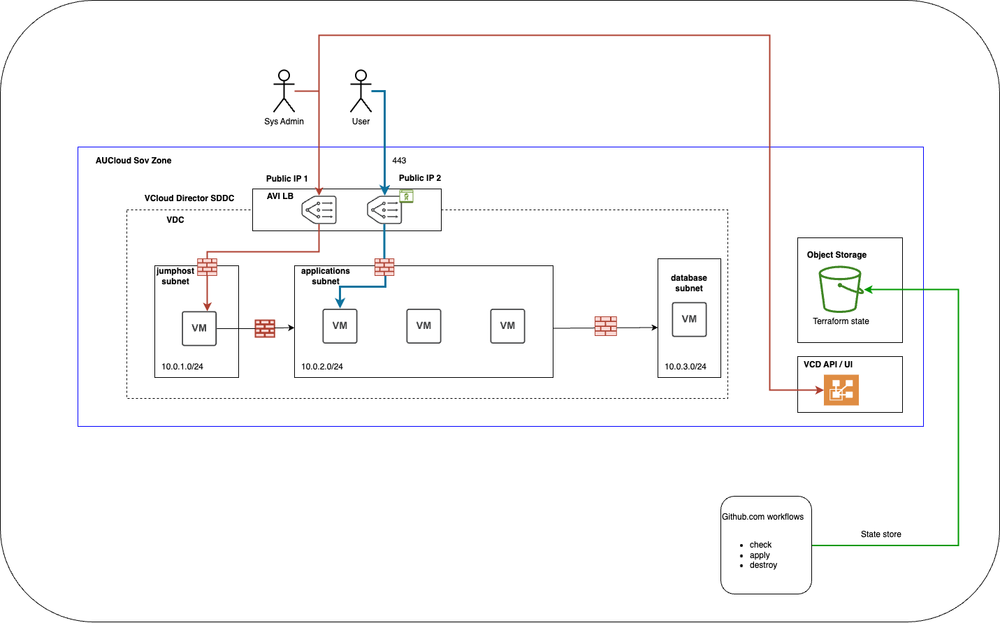

# terraform-vcd-vm-infrastructure-deploy
Terraform is an infrastructure-as-code tool that enables the creation and management of multiple-tier infrastructures. In this demonstration, we will use Terraform to deploy virtual machines on the AUCloud IaaS platform, which is based on VMware Cloud Director. We will also build the necessary networking infrastructure and apply firewalls to ensure security. To allow an entry point for managing services or hosting load balancing abilities, we will assign public IP addresses to the infrastructure. This will enable us to host websites and other services on the infrastructure while providing a secure entry point for managing and accessing those services.

The demonstration will also use a [`virtual service`](https://registry.terraform.io/providers/vmware/vcd/latest/docs/resources/nsxt_alb_virtual_service), allowing users to configure TLS termination, load balancing and advanced firewalls.

This requires that your tenancy has object storage enabled, and that the account used to login to VCD is an 'organizational administrator'.

The project is setup with automation based on [Github actions](https://docs.github.com/en/actions). This can be ported with minimal changes to other CICD environments.

### Security guidance
This system is simple, however, it is not designed for production use:

1. Passwords *must* be set in Github secrets.
2. Currently it does not provide an admin access channel except via the web console.
3. Minimal / no Operating system hardening has been performed.
4. The firewall has no restrictions on outbound.


## How it works
The [github workflows](.github/workflows), are designed to execute a simple trunk based development workflow:

- All of the workflows can be triggered manually
- On a PR to main, `terraform plan` and `terraform validate` are run to provide testing.
- On merging a PR to main, `terraform apply` is run

Two manual only workflows exist:
- A [destroy](.github/workflows/destroy.yml) workflow, which cleans up the environment

## Making it work for your environment
This project requires a number of elements in order for this to work within an AUCloud tenancy


### Upload a Ubuntu cloud image into the catalog
[Ubuntu Cloud images](https://cloud-images.ubuntu.com/) are optimised for automated builds. This demo has been tested with the [Ubuntu 20.04 (Focal Fossa) ova image](https://cloud-images.ubuntu.com/focal/current/focal-server-cloudimg-amd64.ova).
The catalog name and image name will need to be updated in the [tfvars](demo.auto.tfvars) file.

### Choose a Windows Template and copy it into the catalog


### Setting TFVars
Each of the variables in [`demo.auto.tfvars`](demo.auto.tfvars)


### Required Github Secrets
Github [secrets](https://docs.github.com/en/actions/security-guides/encrypted-secrets) are required to be set. The workflows are pre-configured assuming an github secrets environment exist called `demo`.

- `AWS_ACCESS_KEY_ID`: Object storage access key - can be generated from the VCLoud Object Storage Extension
- `AWS_SECRET_ACCESS_KEY`: Object secret access key - can be generated from the VCLoud Object Storage Extension
- `VCD_USER`: VCD username. Takes the form of, in aucloud of `{user-id}` e.g. `100.00`.
- `VCD_PASSWORD`: Your VCD password
- `LINUX_USER`: Provide a username
- `LINUX_PASSWORD`: Provide a password
- `WINDOWS_PASSWORD`: Provide a password

### Setting a different password for cloud init on Linux
Cloud-init is used to set a user password, install packages and update the system. Set a password in Github secrets and this will propagate to the Linux VM.

**SET WINDOWS AND LINUX CREDENTIALS IN GITHUB SECRETS**

Passwords can be stored in Github secrets, the terraform code provided will now hash the secret and pass this onto Cloud-init.

An alternative is to enable only an ssh key in cloud-init e.g.:
```yaml
users:
  - name: root
    lock_passwd: true
    shell: /bin/bash
    ssh-authorized-keys:
      - # SSH key here; or variable to pass in the key from a terraform variable.
```

## Reference links

- [VCD terraform provider](https://registry.terraform.io/providers/vmware/vcd/latest/docs)
- [Terraform docs](https://developer.hashicorp.com/terraform/docs)
- [VCD docs](https://docs.vmware.com/en/VMware-Cloud-Director/index.html)
- [Cloud init](https://cloud-init.io)
- [AUCloud connect](https://connect.australiacloud.com.au/login/)
- [Github actions docs](https://docs.github.com/en/actions)
- [AUCloud PDCE Portal](https://eportal.australiacloud.com.au)
- [AUCloud ODCE Portal](https://portal.australiacloud.com.au)
- [AUCloud EDCE Portal](https://enterprise.australiacloud.com.au)


## Dealing with broken builds
Builds can get broken for a number of reasons such as:

- Manual editing of resources
- Certain terraform file edits (removing of resources before deletions)
- Problems with the downstream edits

If you are worried about edits
- Test in a non prod-environment OR
- Run a destroy workflow before merging code to ensure clean state

### Triage process
1. Attempt the destroy the resources
   1. Two pipelines are provided for running terraform destroy.
      1. One destroys and leaves it empty
      1. One destroys then triggers recreation of the resources
   1. Use the Workflow dispatch button to ensure code is up to date; and a unique github actions run is recoreded.

If a destroy run fails:
1. Try to repeatedly run destroy.
   1. Some resources may not be correctly coded into the DAG resulting in problems with destructions
1. If all else fails
   1. Manually delete / cleanup resources on the target system.
   1. Remove the state file manually (delete) from object storage.

## How it works

